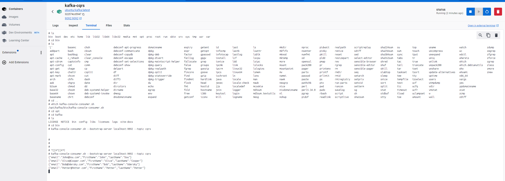
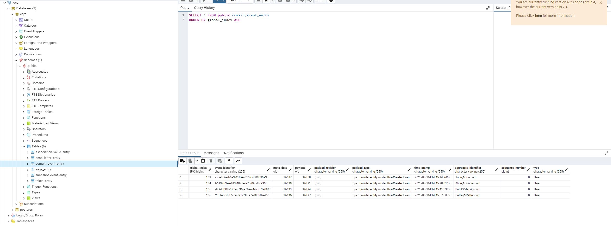

How to run:
1. Build app using `mvn clean install`
2. Move jar file from target folder to root folder and rename to app.jar OR use pre built jar file from root folder
3. Start docker-compose using `docker-compose up -d`
4. Send POST request to `localhost:8080/command` with body
```json
{
    "method": "CREATE_ITEM",
    "params": {
    "definition" : "user",
    "values" : {
       "email" : "Petter@Petter.com",
       "first-name" : "Petter",
       "last-name" : "Petter"
       }
    }
}
```
5. Check db and kafka for output

